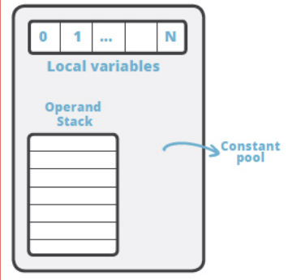
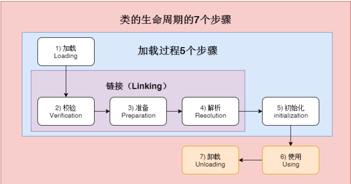
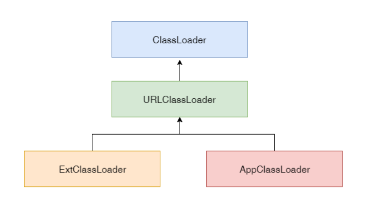
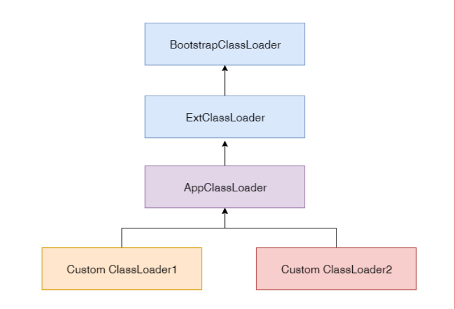

学习笔记~~~~
疑问??
类加载校验阶段是否会让当前类中使用的其他类加载? 如果不会,那解析阶段解析为直接用的时候,指向的实际对象堆中必定存在,如何理解?
接口没有default方法,什么时候加载初始化?


##1.线程栈与字节码执行模型
每个线程有一个自己的线程栈,用于存储栈帧(Frame);
每一次方法调用JVM自动创建一个栈帧.
````
//class引用指向当前方法在运行常量池中对应的class
线程 -> 栈帧 -> 操作数栈、局部变量数组,一个class引用
````


##2.类加载
```markdown
#javac 编译后启动java类
编译后 用$java Hello 命令
或者把Hello.class和依赖的其他文件一起打包成jar文件:
示例 1: 将 class 文件和java源文件归档到一个名为hello.jar 的档案中:
jar cvf hello.jar Hello.class Hello.java
示例 2: 归档的同时，通过 e 选项指定jar的启动类 Hello :
jar cvfe hello.jar Hello Hello.class Hello.java
#jar包启动
$ java ‐jar hello.jar
```
###2.1 Java类加载器
- 1 类的生命周期和加载过程
- 2 类加载时机
- 3 类加载机制
- 4 自定义类加载器示例
- 5 一些实用技巧
####2.1.1 

- 1）加载 -> 根据明确知道的class完全限定名,来获取class文件,通过类加载器完成。
- 2）校验 -> 程检查 classfile 的语义，判断常量池中的符号，并执行类型检查, 会加载父类和接口
- 3）准备 -> 创建静态字段, 并将其初始化为标准默认值null/0(静态常量值直接赋值)
- 4）解析 -> 符号引用解析并链接为直接引用（相当于指向实际对象）,那引用的目标必定在堆中存在。
- 5）初始化-> 

###2.2 类加载时机

###2.3 类加载器机制
类加载器


自定义类加载器


###3 java内存模型
方法中使用的原生数据类型和对象引用地址在栈上存储；对象、对象成员与类定义、静态变量在堆上。
Java中几种常量池的区分 http://tangxman.github.io/2015/07/27/the-difference-of-java-string-pool/
